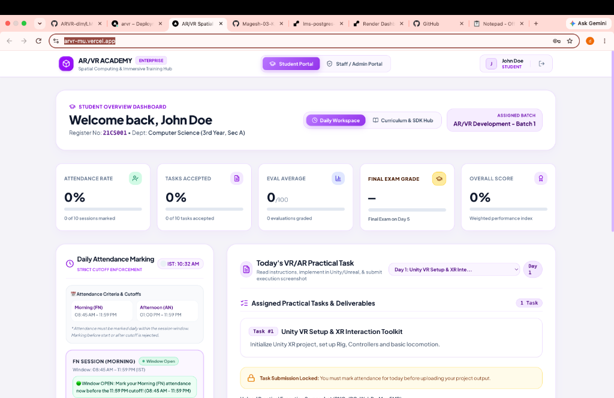
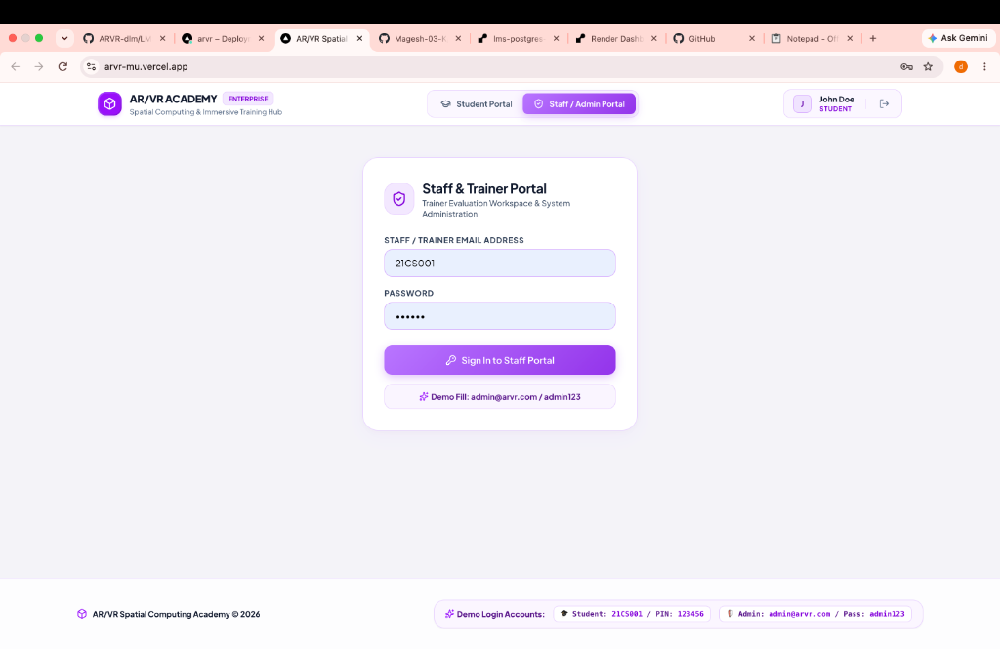
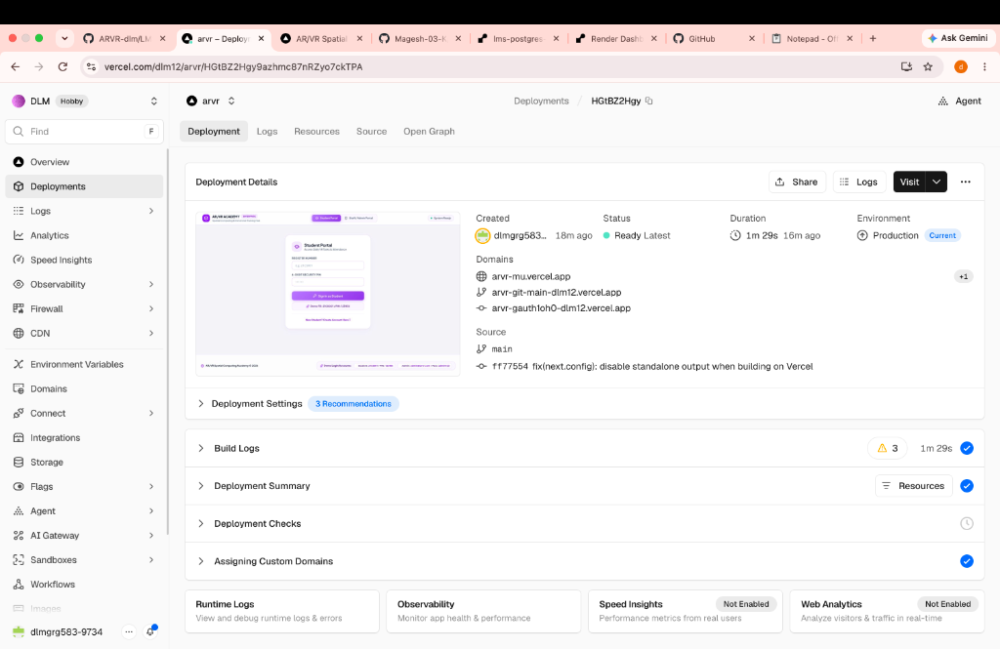

# 🎓 Learning Management System (LMS) - AR/VR Spatial Computing Academy

An enterprise-grade, full-stack spatial computing training management platform built with **Next.js 16 (App Router & Turbopack)**, **TypeScript**, **Prisma ORM**, and **Tailwind CSS**.

🌐 **Live Deployed Application**: [https://arvr-mu.vercel.app](https://arvr-mu.vercel.app)

---

## 📸 Screenshots & Application Preview

### 1. 🎓 Student Portal Dashboard


### 2. 👨‍🏫 Staff & Trainer Portal


### 3. 🚀 Vercel Production Deployment Status


---

## ✨ Overview & Key Features

### 🎓 Student Portal & Learning Workspace
- **Attendance-Gated Task Submission**: Task submissions are unlocked only after both Morning (**FN**) and Afternoon (**AN**) attendance sessions are server-verified for the day.
- **Interactive Screenshot Upload**: Drag-and-drop practical execution screenshot dropzone supporting PNG, JPG, and WebP (up to 5MB) with real-time preview.
- **Curriculum & AR/VR Developer SDK Hub**: Interactive multi-day training schedule (Day 1 to Day 10) with curated SDK docs for **Unity XR Interaction Toolkit (XRI 3.0)**, **Meta Quest Passthrough**, **Unity AR Foundation (ARKit/ARCore)**, and **Spatial Computing Performance Targets (90 FPS)**.
- **Automated Performance Tracking**: Real-time attendance rate (%), task completion index (%), evaluation score average (/100), and certificate eligibility tracking.

### 🛡️ Unified Staff & Instructor Portal
- **Interactive Task Evaluation & Grading**: Review student screenshot submissions, inspect implementation notes, assign numerical scores ($0–100$), letter grades (`O`, `A+`, `A`, `B+`, `B`, `C`), training levels, and feedback.
- **Bulk CSV Student Roster Import**: Enrol entire student classes in 1-click by pasting CSV roster data or uploading a `.csv` file with automatic duplicate detection.
- **Batch Management & Calendar Builder**: Create training batches with start/end dates, assign trainers, and dynamically build daily practical task curricula.
- **Automated Certificate Engine & Excel Export**: Verify attendance ($\ge 75\%$) and task completion rules to generate official certificate numbers and export complete batch records as downloadable `.xlsx` spreadsheets.

### 🔐 Security & Hardening
- **Password & PIN Hashing**: All student PINs, trainer passwords, and admin passwords are salt-hashed using **Bcrypt (10 rounds)**.
- **Sliding IP Rate Limiting**: Endpoint protection on authentication routes (`/api/student/login`, `/api/trainer/login`, `/api/admin/login`) to block brute-force attacks.
- **Encrypted Session Cookies**: Managed via `iron-session` signed with a 32-byte secret (`httpOnly: true`, `sameSite: 'lax'`).
- **Path Traversal & Injection Defense**: Filename sanitization (`/[^a-zA-Z0-9_-]/g`), file extension whitelisting, and Prisma parameterized query execution.

---

## 🛠️ Technology Stack

- **Framework**: [Next.js 16 (App Router & Turbopack)](https://nextjs.org/)
- **Language**: [TypeScript](https://www.typescriptlang.org/)
- **Database & ORM**: [Prisma ORM](https://www.prisma.io/) with [PostgreSQL](https://www.postgresql.org/) (Hosted on Render)
- **Deployment**: [Vercel](https://vercel.com/) (Frontend/API) & [Render](https://render.com/) (PostgreSQL DB)
- **Styling**: [Tailwind CSS](https://tailwindcss.com/)
- **Icons**: [Lucide React](https://lucide.dev/)
- **Authentication**: `iron-session` + `bcryptjs`
- **File Processing & Excel**: `exceljs`, `formidable`

---

## 🔑 Demo Access Credentials

| Role | Username / Email | Password / PIN | Portal Tab |
| :--- | :--- | :--- | :--- |
| **🎓 Student** | `21CS001` | `123456` | Student Portal |
| **👨‍🏫 Trainer** | `trainer@arvr.com` | `trainer123` | Staff / Instructor Portal |
| **🛡️ Admin** | `admin@arvr.com` | `admin123` | Staff / Instructor Portal |

---

## 🚀 Quick Start Guide

### 1. Prerequisites
- **Node.js**: v18.x or higher
- **npm** or **yarn**

### 2. Installation & Running

```bash
# Clone the repository
git clone https://github.com/Magesh-03-K/LMS-System.git
cd LMS-System/ARVR

# Install dependencies
npm install

# Setup environment variables
cp .env.example .env

# Run database migrations and seed demo data
npx prisma migrate deploy
npx prisma db seed

# Launch development server
npm run dev
```

Open [http://localhost:3000](http://localhost:3000) in your browser to view the application.

---

## 📂 Project Architecture

```text
LMS_System/
├── README.md                 # Project Root Documentation
├── deploy.md                 # Vercel & Render Deployment Guide
├── screenshots/              # Application Interface Screenshots
└── ARVR/                     # AR/VR LMS Web Application
    ├── app/
    │   ├── api/              # REST API Routes (Admin, Student, Trainer, Auth)
    │   ├── globals.css       # Global styles & theme configuration
    │   ├── layout.tsx        # Application root layout
    │   └── page.tsx          # Main entry page & portal tab switcher
    ├── components/           # React Components (StudentPortal, StaffPortal, Navbar)
    ├── lib/                  # Utilities (auth, prisma, rateLimit, storage)
    ├── prisma/               # Database Schema & Seeder
    ├── public/               # Static assets & screenshot uploads
    ├── docker-compose.yml    # Docker orchestration setup
    └── Dockerfile            # Container definition
```

---

## 📄 License
This project is licensed under the MIT License.
